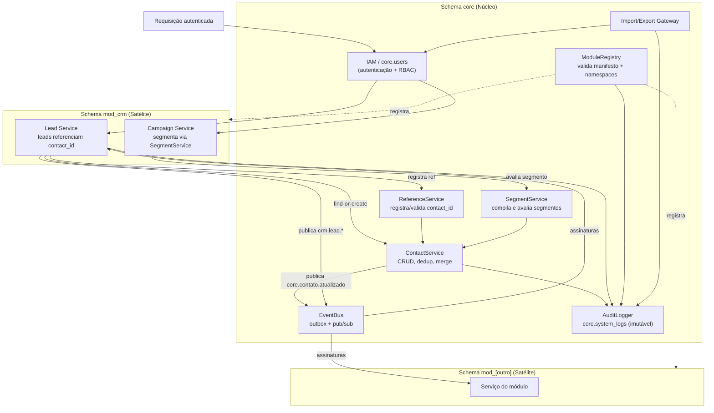
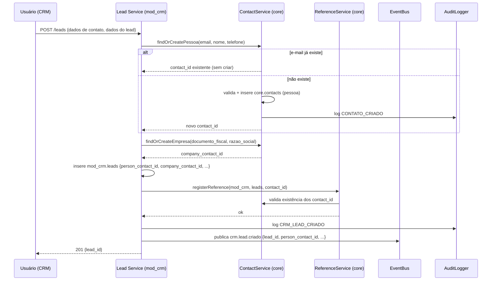
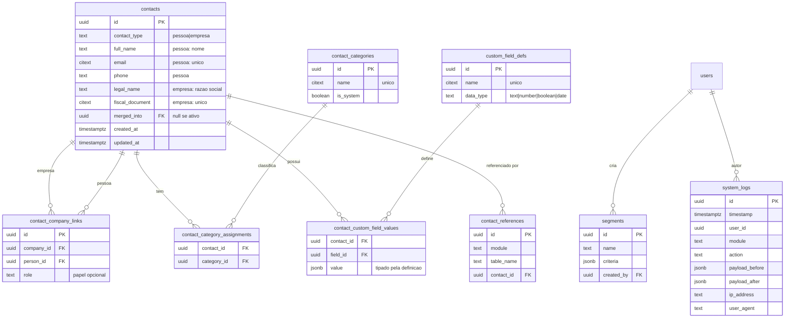

# Design Document

## Overview

Este documento descreve o design técnico da **Base Central de Contatos** (schema `core`) e do **Contrato de Módulos** do HUB Central. Juntos, os dois recursos eliminam a duplicação de dados de contato entre o núcleo e os módulos satélites (a começar por `mod_crm`), estabelecendo o `core.contacts` como fonte única de verdade e formalizando como um módulo se registra, referencia contatos, declara permissões, emite eventos e grava auditoria.

O design é norteado por três princípios da arquitetura HUB Central (§5 e §7 de *Instruções gerais HUB Central*):

1. **Isolamento estrito por schema** — dados do núcleo em `core`, dados de cada módulo em `mod_[nome]`. Nenhum dado de contato é copiado para schemas de módulo; módulos guardam apenas `contact_id` (UUID) como `Referencia_Contato`.
2. **Monólito modular com EDA** — os módulos são desacoplados por um barramento de eventos interno de publicação/assinatura no processo (in-process pub/sub), com envelope padronizado.
3. **Centralização de IAM e auditoria** — identidade em `core.users`, auditoria imutável em `core.system_logs`; nenhum módulo mantém usuários ou logs próprios.

### Escopo

**Dentro do escopo:**
- Modelo de dados de contatos (pessoas/empresas), vínculos empresa↔pessoa, categorias (sistema e customizadas), campos personalizados e segmentos persistidos.
- Deduplicação por e-mail (pessoa) e documento fiscal (empresa) e operação de mesclagem.
- Avaliação de segmento retornando apenas `contact_id`.
- Proteção de exclusão de contatos com referências ativas.
- Contrato de módulo: manifesto e validação, referência por `contact_id`, RBAC, import/export, barramento de eventos, auditoria.
- Redesenho da tabela `mod_crm.leads` para referenciar contatos e o fluxo find-or-create.

**Fora do escopo (herdado / não alterado):** IAM/login, branding, Cron Engine, backups, e a lógica de SLA/pipeline/campanhas do CRM que não toca em dados de contato.

### Mapeamento de decisões-chave

| Decisão | Escolha | Justificativa |
|---|---|---|
| Modelagem de campos personalizados | **Híbrido: definição relacional + valores JSONB tipados por definição** (não EAV puro) | Ver seção *Data Models → Campos Personalizados*. Evita a explosão de linhas e joins do EAV, mantém tipagem forte e permite índices GIN para filtragem. |
| Discriminador de tipo de contato | Coluna `contact_type` ENUM `('pessoa','empresa')` na tabela única `core.contacts` | Single Table com CHECKs condicionais: consultas cross-type simples, FKs uniformes a partir dos módulos. |
| Integridade referencial cross-schema | FK física `mod_*.* → core.contacts(id)` **+** registro de referências em `core.contact_references` | FK garante que não existe `contact_id` órfão (Req 7.4); a tabela de referências permite listar módulos e bloquear exclusão (Req 7.5) sem varrer todos os schemas. |
| Barramento de eventos | Pub/sub in-process com fila durável em `core.event_outbox` (transactional outbox) | Adequado ao monólito modular; entrega ao menos uma vez, resiliente a falhas, sem dependência de broker externo. |
| Avaliação de segmento | Compilação dos critérios para uma query SQL parametrizada que projeta apenas `contact_id` | Cumpre Req 6.2/6.3 (retorna só referências) e mantém a segmentação no banco, sem transferir dados sensíveis. |

## Architecture

### Visão de componentes

O núcleo expõe serviços internos consumidos pelos módulos exclusivamente por meio de uma **API de serviço do núcleo** (camada de aplicação), nunca por acesso direto às tabelas de outro schema além da FK de referência.



**Responsabilidades:**

- **ContactService** — cria/edita/mescla contatos, aplica validações (Req 1), deduplicação (Req 5), publica `core.contato.atualizado` (Req 12.4) e grava auditoria (Req 1.7, 3.4, 5.6).
- **SegmentService** — persiste critérios de segmento (Req 6.4), compila para SQL e avalia retornando apenas `contact_id` (Req 6.1–6.3, 6.5).
- **ReferenceService** — registra cada `Referencia_Contato` de módulo em `core.contact_references`, valida existência do `contact_id` (Req 7.4) e bloqueia exclusão com referências ativas (Req 7.5).
- **ModuleRegistry** — valida o `Manifesto_Modulo` e os `RBAC_Namespace` (Req 8, 10.1–10.2).
- **EventBus** — envelope padronizado, publish/subscribe, entrega durável (Req 12).
- **AuditLogger** — única porta de escrita em `core.system_logs`, que é append-only (Req 13).
- **Import/Export Gateway** — encapsula os endpoints de import/export e a verificação de permissão (Req 11).

### Fronteira de acesso entre schemas

- Um módulo **pode** ter FKs físicas para `core.contacts(id)` e `core.users(id)` (leitura por referência).
- Um módulo **não pode** copiar `name`/`email`/`phone`/documento fiscal para suas tabelas (Req 7.2). A conformidade é garantida por revisão do manifesto/migrations e por um lint de schema descrito em *Error Handling*.
- Toda escrita em dados de contato passa pelo `ContactService`; toda escrita de auditoria passa pelo `AuditLogger`.

### Fluxo: criação de lead com find-or-create de contato (Req 14.2/14.3)



## Components and Interfaces

As assinaturas abaixo são independentes de linguagem (o backend de referência é Node.js 20+, conforme §12 do CRM). Erros descritivos seguem o formato `{ code, message, details }`.

### ContactService

```
createContact(input: ContactInput): Contact            // Req 1.1–1.6
  // valida campos obrigatórios por tipo, valida e-mail (Req 1.5),
  // aplica dedup (Req 5.1–5.4), grava auditoria (Req 1.7)

updateContact(id: UUID, patch: ContactPatch): Contact   // Req 1.7, 12.4
  // grava payload_before/after; publica core.contato.atualizado

mergeContacts(sourceId: UUID, targetId: UUID): MergeResult  // Req 5.5–5.6
  // exige mesmo contact_type; transfere links, categorias,
  // valores de campo personalizado e referências de módulo;
  // marca source como merged; grava auditoria

linkCompanyPerson(companyId, personId, role?): Link      // Req 2.1–2.5
unlinkCompanyPerson(companyId, personId): void
getCompaniesOfPerson(personId): Contact[]                // Req 2.6

assignCategory(contactId, categoryId): void              // Req 3.2, 3.4
createCustomCategory(name, ...): Category                // Req 3.3, 3.5
listContactsByCategory(categoryIds): UUID[]              // Req 3.6

defineCustomField(name, dataType): CustomFieldDef        // Req 4.1
setCustomFieldValue(contactId, fieldId, value): void     // Req 4.2–4.4
findContactsByCustomField(fieldId, value): UUID[]        // Req 4.5

getContactData(id: UUID): ContactView                    // Req 7.3, 14.5
deleteContact(id: UUID): void                            // Req 7.5 (bloqueia se referenciado)
```

### SegmentService

```
createSegment(criteria: SegmentCriteria, userId: UUID): Segment  // Req 6.4
evaluateSegment(segment: Segment | SegmentCriteria): UUID[]      // Req 6.1, 6.2, 6.5
  // se criteria vazio -> erro (Req 6.5); retorna apenas contact_id
resolveForModule(segmentId): ContactReference[]                 // Req 6.3
```

`SegmentCriteria` é uma conjunção (AND) de predicados sobre categorias, vínculos e campos personalizados:

```
SegmentCriteria = {
  categories?: UUID[],              // contato pertence a TODAS as categorias
  linkedToCompany?: UUID,           // pessoa vinculada à empresa dada
  customFields?: { fieldId, op, value }[]  // op: eq | contains | gt | lt
}
```

### ReferenceService

```
registerReference(module, tableName, contactId): void   // Req 7.1, 7.4
removeReference(module, tableName, contactId): void
listModulesReferencing(contactId): string[]             // Req 7.5
hasActiveReferences(contactId): boolean                 // Req 7.5
```

### ModuleRegistry

```
registerModule(manifest: ModuleManifest, namespaces: string[]): Registration
  // Req 8.1–8.8, 10.1–10.2
validateManifest(manifest): ValidationResult
  // campos obrigatórios (8.2), module_id único (8.3),
  // schema mod_[nome] (8.4), requires_core_tables existem (8.5–8.6),
  // version SemVer (8.8)
validateNamespaces(namespaces): ValidationResult
  // formato [modulo]:[recurso]:[acao] (10.2)
```

### EventBus

```
publish(event: EventEnvelope): void        // Req 12.1–12.4
subscribe(pattern: string, handler): void   // pattern ex.: "core.contato.*"
```

### AuditLogger

```
log(entry: AuditEntry): void   // Req 13.1, 13.3 — única porta de escrita
// core.system_logs é append-only; UPDATE/DELETE revogados (Req 13.4)
```

### Import/Export Gateway

```
export(module, resource, format, userId): FileStream   // Req 11.1, 11.3, 11.5, 11.7
import(module, resource, format, file, userId): ImportResult  // Req 11.2, 11.4, 11.5, 11.6, 11.7
// format ∈ {csv, json, xlsx}; verifica RBAC [modulo]:[recurso]:{exportar|importar}
```

## Data Models

### Schema `core` — visão ER



### `core.contacts` (Req 1, 5)

Tabela única com discriminador `contact_type` e CHECKs condicionais.

| Coluna | Tipo | Regras |
|---|---|---|
| `id` | UUID PK | `gen_random_uuid()` |
| `contact_type` | TEXT | CHECK `IN ('pessoa','empresa')` (Req 1.2) |
| `full_name` | TEXT | obrigatório se `pessoa` (Req 1.3) |
| `email` | CITEXT | obrigatório se `pessoa`; validado por regex (Req 1.5) |
| `phone` | TEXT | obrigatório se `pessoa` (Req 1.3) |
| `legal_name` | TEXT | obrigatório se `empresa` (Req 1.4) |
| `fiscal_document` | CITEXT | obrigatório se `empresa` (Req 1.4) |
| `merged_into` | UUID FK→contacts.id | NULL = ativo; preenchido quando o contato foi mesclado em outro (Req 5.5) |
| `created_at` / `updated_at` | TIMESTAMPTZ | automáticos |

CHECKs e índices:

- `CHECK (contact_type='pessoa' AND full_name IS NOT NULL AND email IS NOT NULL AND phone IS NOT NULL) OR (contact_type='empresa' AND legal_name IS NOT NULL AND fiscal_document IS NOT NULL)` (Req 1.3, 1.4, 1.6).
- `CHECK (email ~ '^[^\s@]+@[^\s@]+\.[^\s@]{2,}$')` quando não nulo (Req 1.5).
- **Dedup (Req 5):** índice único parcial `ON contacts(email) WHERE contact_type='pessoa' AND merged_into IS NULL`; índice único parcial `ON contacts(fiscal_document) WHERE contact_type='empresa' AND merged_into IS NULL`. A verificação prévia (Req 5.1/5.3) roda no serviço para poder retornar o `contact_id` existente na mensagem de erro (Req 5.2/5.4); o índice é a rede de segurança contra corrida.

Uso de `CITEXT` para `email`/`fiscal_document` garante unicidade case-insensitive.

### `core.contact_company_links` (Req 2)

| Coluna | Tipo | Regras |
|---|---|---|
| `id` | UUID PK | |
| `company_id` | UUID FK→contacts.id | deve apontar para contato `empresa` (Req 2.4) |
| `person_id` | UUID FK→contacts.id | deve apontar para contato `pessoa` |
| `role` | TEXT | papel opcional da pessoa na empresa (Req 2.3) |

- `UNIQUE (company_id, person_id)` (Req 2.5).
- A validação de que `company_id` é do tipo `empresa` e `person_id` é do tipo `pessoa` é feita no serviço/trigger, pois a FK não distingue o subtipo (Req 2.4).

### `core.contact_categories` e `core.contact_category_assignments` (Req 3)

| `contact_categories` | Tipo | Regras |
|---|---|---|
| `id` | UUID PK | |
| `name` | CITEXT | `UNIQUE` (Req 3.5) |
| `is_system` | BOOLEAN | `true` para as 5 categorias de sistema (Req 3.1), imutáveis/não deletáveis |

Seed de sistema (Req 3.1): `lead_frio`, `cliente_ativo`, `cliente_inativo`, `fornecedor_ativo`, `fornecedor_inativo`.

| `contact_category_assignments` | Tipo | Regras |
|---|---|---|
| `contact_id` | UUID FK→contacts.id | |
| `category_id` | UUID FK→contact_categories.id | |
| PK composta | `(contact_id, category_id)` | associação N:N (Req 3.2) |

Consulta por categoria (Req 3.6) e alteração auditada com categoria anterior/nova (Req 3.4).

### Campos Personalizados — decisão de modelagem (Req 4)

**Recomendação: modelo híbrido — definições relacionais + valores em coluna JSONB tipada por definição.** Comparação:

| Abordagem | Prós | Contras |
|---|---|---|
| **EAV puro** (uma linha por valor com coluna `text`) | flexível | perde tipagem (tudo vira texto), muitos joins, difícil validar/filtrar, integridade fraca |
| **JSONB único por contato** (um documento na tabela `contacts`) | simples | sem definição central de campos (Req 4.1), sem tipagem por campo, difícil validar tipo (Req 4.3) |
| **Híbrido (escolhido)** | definição central e tipada dos campos (Req 4.1), valor validado contra o tipo (Req 4.3/4.4), filtragem indexável por GIN (Req 4.5), sem explosão de linhas | uma tabela de valores a mais |

Estruturas:

| `custom_field_defs` | Tipo | Regras |
|---|---|---|
| `id` | UUID PK | |
| `name` | CITEXT | `UNIQUE` (ex.: "escola_dos_filhos") |
| `data_type` | TEXT | CHECK `IN ('text','number','boolean','date')` (Req 4.1) |

| `contact_custom_field_values` | Tipo | Regras |
|---|---|---|
| `contact_id` | UUID FK→contacts.id | |
| `field_id` | UUID FK→custom_field_defs.id | |
| `value` | JSONB | validado contra `data_type` da definição (Req 4.3/4.4) |
| PK composta | `(contact_id, field_id)` | um valor por campo por contato |

- Validação de tipo (Req 4.3/4.4): o serviço confere o tipo JSON do `value` (string/number/boolean/date-ISO) contra `data_type`; rejeita com erro descritivo em caso de divergência.
- Filtragem (Req 4.5): índice `GIN` sobre `value` e busca por `field_id` + operador.

### `core.contact_references` (Req 7)

Registra cada referência de módulo a um contato, permitindo listar módulos e bloquear exclusão sem varrer schemas.

| Coluna | Tipo | Regras |
|---|---|---|
| `id` | UUID PK | |
| `module` | TEXT | ex.: `mod_crm` |
| `table_name` | TEXT | ex.: `leads` |
| `contact_id` | UUID FK→contacts.id | `ON DELETE RESTRICT` (Req 7.4 garante contato existente; 7.5 bloqueia exclusão) |
| `UNIQUE (module, table_name, contact_id)` | | idempotência de registro |

`deleteContact` consulta `hasActiveReferences`; se houver, rejeita e retorna `listModulesReferencing` (Req 7.5).

### `core.segments` (Req 6)

| Coluna | Tipo | Regras |
|---|---|---|
| `id` | UUID PK | |
| `name` | TEXT | |
| `criteria` | JSONB | `SegmentCriteria` persistido (Req 6.4) |
| `created_by` | UUID FK→users.id | (Req 6.4) |
| `created_at` | TIMESTAMPTZ | |

Avaliação (Req 6.2) compila `criteria` para SQL parametrizado que faz `SELECT id FROM core.contacts` com joins/EXISTS para categorias, vínculos e campos personalizados, projetando **apenas** `id`. Critério vazio → erro (Req 6.5).

### `core.system_logs` — auditoria imutável (Req 13)

Estrutura conforme §5 da arquitetura: `id`, `timestamp` (UTC), `user_id`, `module`, `action`, `payload_before` (JSONB), `payload_after` (JSONB), `ip_address`, `user_agent` (Req 13.3).

Imutabilidade (Req 13.4): a role da aplicação recebe apenas `INSERT`/`SELECT`; `UPDATE` e `DELETE` são bloqueados por `REVOKE` e reforçados por trigger `BEFORE UPDATE OR DELETE` que lança exceção. Expurgo/rotação (fora deste escopo) é privilégio separado do SuperAdmin.

### `core.event_outbox` — barramento durável (Req 12)

| Coluna | Tipo | Descrição |
|---|---|---|
| `id` | UUID PK | |
| `event_name` | TEXT | `[modulo].[recurso].[acao]` (Req 12.2) |
| `envelope` | JSONB | `EventEnvelope` completo (Req 12.3) |
| `status` | TEXT | `pending` \| `dispatched` |
| `created_at` | TIMESTAMPTZ | |

O produtor grava o evento na mesma transação da mudança de dados (transactional outbox); um despachante entrega aos assinantes e marca `dispatched`, garantindo entrega ao menos uma vez sem broker externo.

### Contrato de Módulo — `ModuleManifest` (Req 8)

```json
{
  "module_id": "mod_crm",
  "display_name": "CRM Comercial",
  "schema": "mod_crm",
  "version": "1.0.0",
  "config_panel": true,
  "has_export": true,
  "has_import": true,
  "emits_events": true,
  "requires_core_tables": ["core.users", "core.contacts"]
}
```

Persistido em `core.registered_modules` (`module_id` PK, `manifest` JSONB, `version`, `registered_at`). Regras de validação: campos obrigatórios (8.2), `module_id` único (8.3), `schema` casa `^mod_[a-z0-9_]+$` (8.4), cada tabela de `requires_core_tables` existe em `information_schema` (8.5/8.6), `version` casa SemVer `^\d+\.\d+\.\d+$` (8.8). Registro bem-sucedido gera auditoria (8.7).

### Envelope de Evento — `EventEnvelope` (Req 12)

```json
{
  "event_name": "core.contato.atualizado",
  "event_id": "uuid",
  "occurred_at": "2026-06-18T12:00:00Z",
  "producer_module": "core",
  "payload": { "contact_id": "uuid" },
  "correlation_id": "uuid"
}
```

- `event_name` no formato `[modulo].[recurso].[acao]` (Req 12.2).
- Eventos que envolvem contato carregam **apenas** `contact_id` no `payload` (Req 12.3).
- `core.contato.atualizado` é publicado pelo `ContactService.updateContact` (Req 12.4).

### Migração do CRM — `mod_crm.leads` redesenhada (Req 14)

As colunas `name`, `company`, `email`, `phone` são **removidas** e substituídas por duas referências de contato:

| Coluna (nova) | Tipo | Regras |
|---|---|---|
| `person_contact_id` | UUID FK→core.contacts.id | Contato_Pessoa do lead (Req 14.1) |
| `company_contact_id` | UUID FK→core.contacts.id | Contato_Empresa do lead (Req 14.1) |

Demais colunas do `mod_crm.leads` (source, product, assigned_to, column_id, tags, sla_*, status, etc.) permanecem. Fluxo de migração:

1. **Migration de dados:** para cada lead existente, executa find-or-create de pessoa (por `email`) e de empresa (por documento fiscal quando disponível; senão por `company` como razão social), preenche `person_contact_id`/`company_contact_id`, registra em `core.contact_references`, e então dropa as 4 colunas antigas.
2. **Criação de lead (Req 14.2/14.3):** `findOrCreate` — se o e-mail já existe, reutiliza o `contact_id` sem criar; senão cria o contato.
3. **Exibição (Req 14.5):** o CRM lê dados de contato via `ContactService.getContactData(contact_id)`; nada de contato fica em `mod_crm`.
4. **Campanhas (Req 14.4):** segmentação passa a usar `SegmentService.evaluateSegment`; o array `leads.tags` pode mapear para categorias/campos no core, e a campanha recebe apenas `contact_id`.

Os eventos `crm.lead.*` passam a carregar `person_contact_id`/`company_contact_id` no lugar de `name`/`company`/`email` (Req 12.3).

## Correctness Properties

*Uma propriedade é uma característica ou comportamento que deve ser verdadeiro em todas as execuções válidas do sistema — essencialmente, uma afirmação formal sobre o que o sistema deve fazer. As propriedades servem de ponte entre especificações legíveis por humanos e garantias de correção verificáveis por máquina.*

As propriedades abaixo derivam da análise de prework das acceptance criteria. Critérios de wiring/infra (integração, smoke) e regras de schema não geram propriedades — são cobertos na *Testing Strategy* por testes de integração e lint de schema.

### Property 1: Identidade única do contato

*Para qualquer* conjunto de entradas de contato válidas, cada contato criado recebe exatamente um `contact_id` UUID distinto e é persistido como um único registro em `core.contacts`.

**Validates: Requirements 1.1**

### Property 2: Completude de campos obrigatórios por tipo

*Para qualquer* entrada de contato, a criação é aceita se e somente se todos os campos obrigatórios do seu `contact_type` estão presentes (pessoa: nome, e-mail, telefone; empresa: razão social, documento fiscal); quando faltante, a criação é rejeitada com uma mensagem que identifica o campo ausente.

**Validates: Requirements 1.3, 1.4, 1.6**

### Property 3: Validação de e-mail

*Para qualquer* string fornecida como e-mail de contato, a criação é aceita se e somente se a string casa com o padrão `^[^\s@]+@[^\s@]+\.[^\s@]{2,}$`.

**Validates: Requirements 1.5**

### Property 4: Round-trip de vínculo empresa↔pessoa

*Para qualquer* Contato_Empresa e conjunto de Contato_Pessoa, após criar os vínculos (com papéis opcionais), consultar cada pessoa retorna exatamente o conjunto de empresas às quais ela foi vinculada, com os papéis informados preservados.

**Validates: Requirements 2.1, 2.2, 2.3, 2.6**

### Property 5: Vínculo respeita o tipo do lado empresa

*Para qualquer* par (company_id, person_id), a criação do vínculo é rejeitada com mensagem descritiva se o `company_id` não referencia um Contato_Empresa (ou o `person_id` não referencia um Contato_Pessoa).

**Validates: Requirements 2.4**

### Property 6: Vínculo é único por par (idempotência)

*Para qualquer* par empresa/pessoa já vinculado, uma nova tentativa de criar o mesmo vínculo é rejeitada e o número de vínculos entre o par permanece igual a um.

**Validates: Requirements 2.5**

### Property 7: Round-trip de categoria e filtragem

*Para qualquer* contato e conjunto de categorias associadas, consultar contatos filtrando por qualquer subconjunto não vazio dessas categorias inclui o contato, e filtrar por uma categoria não associada o exclui.

**Validates: Requirements 3.2, 3.6**

### Property 8: Categoria customizada criada fica disponível

*Para qualquer* nome de categoria não conflitante, criar a Categoria_Customizada torna-a disponível para associação e listagem junto às demais categorias.

**Validates: Requirements 3.3**

### Property 9: Unicidade de nome de categoria (case-insensitive)

*Para qualquer* categoria existente, tentar criar uma Categoria_Customizada com nome idêntico (ignorando caixa) é rejeitado com mensagem descritiva.

**Validates: Requirements 3.5**

### Property 10: Round-trip de valor de campo personalizado

*Para qualquer* definição de campo personalizado e valor válido para o seu tipo, após atribuir o valor a um contato, consultar contatos filtrando por esse valor retorna o contato.

**Validates: Requirements 4.2, 4.5**

### Property 11: Validação de valor contra o tipo do campo

*Para qualquer* definição de campo personalizado e valor candidato, a atribuição é aceita se e somente se o valor está em conformidade com o `data_type` definido; caso contrário é rejeitada com mensagem descritiva.

**Validates: Requirements 4.1, 4.3, 4.4**

### Property 12: Deduplicação por chave natural

*Para qualquer* contato já existente, tentar criar outro contato do mesmo tipo com a mesma chave natural (e-mail para pessoa, documento fiscal para empresa; comparação case-insensitive) é rejeitado e a mensagem de erro contém o `contact_id` do contato existente.

**Validates: Requirements 5.1, 5.2, 5.3, 5.4**

### Property 13: Mesclagem conserva e transfere tudo

*Para quaisquer* dois contatos do mesmo tipo (origem e destino), após a mesclagem o destino possui a união dos vínculos, categorias, valores de campo personalizado e referências de módulo de ambos, e nenhuma referência de módulo aponta mais para a origem (nada é perdido nem duplicado).

**Validates: Requirements 5.5**

### Property 14: Segmento retorna exatamente quem satisfaz todos os critérios

*Para qualquer* base de contatos e `SegmentCriteria`, a avaliação retorna exatamente o conjunto de `contact_id` cujos contatos satisfazem simultaneamente todos os critérios (equivalente a um filtro de referência ingênuo em memória).

**Validates: Requirements 6.1, 6.2**

### Property 15: Saída de segmento contém apenas referências

*Para qualquer* segmento avaliado pela interface de módulo, cada item de saída contém somente o `contact_id`, sem nenhum dado de contato (nome, e-mail, telefone, documento).

**Validates: Requirements 6.3**

### Property 16: Segmento sem critérios é rejeitado

*Para qualquer* segmento cujo conjunto de critérios é vazio, a avaliação é rejeitada com mensagem descritiva.

**Validates: Requirements 6.5**

### Property 17: Referência exige contato existente

*Para qualquer* `contact_id`, registrar uma Referencia_Contato de módulo é aceito se e somente se o contato existe; caso contrário a operação é rejeitada com mensagem descritiva.

**Validates: Requirements 7.4**

### Property 18: Exclusão bloqueada por referências ativas

*Para qualquer* contato, a exclusão é permitida se e somente se não existe nenhuma Referencia_Contato ativa; quando existe ao menos uma, a exclusão é bloqueada e a resposta contém exatamente a lista de módulos que referenciam o contato.

**Validates: Requirements 7.5**

### Property 19: Campos obrigatórios do manifesto

*Para qualquer* `Manifesto_Modulo`, o registro é aceito se e somente se todos os campos obrigatórios (`module_id`, `display_name`, `schema`, `version`, `config_panel`, `has_export`, `has_import`, `emits_events`, `requires_core_tables`) estão presentes; quando faltante, o registro é rejeitado com mensagem que identifica o campo ausente.

**Validates: Requirements 8.1, 8.2**

### Property 20: Unicidade de module_id no registro

*Para qualquer* `module_id` já registrado, uma nova tentativa de registro com o mesmo `module_id` é rejeitada com mensagem descritiva.

**Validates: Requirements 8.3**

### Property 21: Padrão do schema do módulo

*Para qualquer* valor de `schema` em um manifesto, o registro é aceito (quanto a esse campo) se e somente se casa com o padrão `^mod_[a-z0-9_]+$`.

**Validates: Requirements 8.4**

### Property 22: Verificação de tabelas de núcleo requeridas

*Para qualquer* lista `requires_core_tables`, o registro conclui se e somente se todas as tabelas declaradas existem; caso contrário é rejeitado e a mensagem nomeia uma tabela ausente.

**Validates: Requirements 8.5, 8.6**

### Property 23: Versão em SemVer

*Para qualquer* string de `version`, o registro é aceito (quanto a esse campo) se e somente se casa com o padrão SemVer `^\d+\.\d+\.\d+$`.

**Validates: Requirements 8.8**

### Property 24: Formato de RBAC_Namespace

*Para qualquer* string de namespace declarada, o registro é aceito (quanto a esse namespace) se e somente se casa com o formato `[modulo]:[recurso]:[acao]` (três segmentos separados por `:`); caso contrário o registro é rejeitado e a mensagem nomeia o namespace inválido.

**Validates: Requirements 10.1, 10.2**

### Property 25: Autorização por posse de namespace

*Para qualquer* usuário e ação de módulo (incluindo exportar e importar), a ação é permitida se e somente se o usuário possui o `RBAC_Namespace` correspondente (`[modulo]:[recurso]:[acao]`); caso contrário é negada com erro de acesso negado.

**Validates: Requirements 10.3, 10.4, 11.3, 11.4, 11.5**

### Property 26: Importação valida antes de persistir

*Para qualquer* arquivo de importação com linhas válidas e inválidas, apenas as linhas válidas são persistidas e cada linha rejeitada é retornada com o motivo da rejeição.

**Validates: Requirements 11.6**

### Property 27: Formato do nome de evento

*Para qualquer* nome de evento publicado, ele está no formato `[modulo].[recurso].[acao]` (três segmentos separados por `.`).

**Validates: Requirements 12.2**

### Property 28: Evento de contato carrega apenas a referência

*Para qualquer* evento que envolve um contato, o `payload` contém o `contact_id` e nenhum dado de contato (nome, e-mail, telefone, documento).

**Validates: Requirements 12.3**

### Property 29: Alteração de contato publica core.contato.atualizado

*Para qualquer* alteração de dados de um contato, o HUB_Central publica exatamente um evento `core.contato.atualizado` cujo `payload.contact_id` é o do contato alterado.

**Validates: Requirements 12.4**

### Property 30: Toda ação auditável gera um log completo e correto

*Para qualquer* ação auditável (criação/alteração de contato, alteração de categoria, mesclagem, registro de módulo, importação/exportação e ações de módulo), é gravada em `core.system_logs` exatamente uma entrada contendo `id`, `timestamp` em UTC, `user_id`, `module` (nome do módulo ou `core`), `action`, `payload_before`, `payload_after`, `ip_address` e `user_agent`, coerentes com a ação (incluindo estados anterior/novo em alterações e origem/destino em mesclagens).

**Validates: Requirements 1.7, 3.4, 5.6, 8.7, 11.7, 13.1, 13.3**

### Property 31: Imutabilidade do log de auditoria

*Para qualquer* entrada gravada em `core.system_logs`, qualquer tentativa de `UPDATE` ou `DELETE` falha e o conteúdo da entrada permanece inalterado.

**Validates: Requirements 13.4**

### Property 32: Identidade find-or-create do CRM é idempotente

*Para qualquer* conjunto de dados de contato, criar dois leads no `mod_crm` com o mesmo e-mail de pessoa resulta em ambos apontando para o mesmo `person_contact_id` e em nenhum contato duplicado criado; um e-mail novo resulta na criação de um único contato associado ao lead.

**Validates: Requirements 14.2, 14.3**

## Error Handling

Todos os erros retornam o formato `{ code, message, details }`, com `message` descritiva conforme exigido pelos requisitos.

| Situação | Código | Comportamento | Req |
|---|---|---|---|
| Campo obrigatório de contato ausente | `CONTACT_MISSING_FIELD` | rejeita; `details.field` nomeia o campo | 1.6 |
| E-mail inválido | `CONTACT_INVALID_EMAIL` | rejeita | 1.5 |
| Pessoa duplicada (e-mail) | `CONTACT_DUPLICATE_EMAIL` | rejeita; `details.existing_contact_id` | 5.1, 5.2 |
| Empresa duplicada (documento) | `CONTACT_DUPLICATE_DOCUMENT` | rejeita; `details.existing_contact_id` | 5.3, 5.4 |
| Vínculo com lado empresa inválido | `LINK_INVALID_COMPANY` | rejeita | 2.4 |
| Vínculo duplicado | `LINK_DUPLICATE` | rejeita | 2.5 |
| Categoria duplicada | `CATEGORY_DUPLICATE_NAME` | rejeita | 3.5 |
| Valor de campo personalizado com tipo incorreto | `CUSTOM_FIELD_TYPE_MISMATCH` | rejeita; `details.expected_type` | 4.4 |
| Segmento sem critérios | `SEGMENT_EMPTY_CRITERIA` | rejeita | 6.5 |
| Referência a contato inexistente | `REFERENCE_CONTACT_NOT_FOUND` | rejeita | 7.4 |
| Exclusão de contato referenciado | `CONTACT_HAS_REFERENCES` | bloqueia; `details.modules[]` | 7.5 |
| Manifesto com campo ausente | `MANIFEST_MISSING_FIELD` | rejeita; `details.field` | 8.2 |
| module_id já registrado | `MODULE_ALREADY_REGISTERED` | rejeita | 8.3 |
| Schema fora do padrão | `MANIFEST_INVALID_SCHEMA` | rejeita | 8.4 |
| Tabela de núcleo ausente | `MANIFEST_MISSING_CORE_TABLE` | rejeita; `details.missing_table` | 8.6 |
| Versão não-SemVer | `MANIFEST_INVALID_VERSION` | rejeita | 8.8 |
| Namespace inválido | `RBAC_INVALID_NAMESPACE` | rejeita; `details.namespace` | 10.2 |
| Requisição não autenticada | `AUTH_UNAUTHORIZED` (401) | rejeita | 9.4 |
| Ação/export/import sem permissão | `RBAC_ACCESS_DENIED` (403) | nega | 10.4, 11.5 |
| Linha de importação inválida | (não é erro fatal) | linha rejeitada com motivo; demais persistem | 11.6 |

Princípio herdado da arquitetura (§6.3): falhas de integração externa são capturadas, registradas em auditoria e não derrubam o HUB_Central. Erros de escrita de contato revertem a transação (atomicidade), incluindo o evento no outbox.

## Testing Strategy

### Abordagem dupla

- **Testes de propriedade (PBT):** validam as 32 propriedades acima com entradas geradas aleatoriamente. Este feature é fortemente adequado a PBT porque a maior parte da lógica é pura ou de banco determinístico: validadores (e-mail, SemVer, namespace, nome de evento, tipo de campo), deduplicação, mesclagem, avaliação de segmento e verificação de RBAC têm propriedades universais claras.
- **Testes de exemplo (unitários):** casos concretos e de fronteira — presença das 5 categorias de sistema (seed), persistência de `contact_type`, round-trip de definição de campo e de segmento, atribuição de namespace por papel.
- **Testes de integração:** wiring que não varia de forma reveladora com o input — autenticação IAM nas rotas de módulo (401/200), leitura de contato via `getContactData`, campanha consumindo `evaluateSegment`, e a migração do `mod_crm.leads`.
- **Lint de schema (verificação de contrato):** teste automatizado que inspeciona as migrations dos schemas `mod_*` e falha se: houver colunas de dados de contato (nome/e-mail/telefone/documento) — Req 7.1/7.2; houver tabela de usuários — Req 9.1; houver tabela de logs de auditoria — Req 13.2; ou `mod_crm.leads` ainda contiver `name`/`company`/`email`/`phone` — Req 14.1.

### Biblioteca e configuração de PBT

- Backend de referência: Node.js 20+ (§12 do CRM). Biblioteca de PBT recomendada: **fast-check** (não implementar PBT do zero).
- Cada propriedade é implementada por **um único** teste de propriedade.
- Mínimo de **100 iterações** por teste de propriedade (`{ numRuns: 100 }`).
- Testes de banco usam uma base efêmera (ex.: container Postgres 15 de teste) com transação revertida por caso quando possível; a avaliação de segmento (P14) usa um oráculo de referência em memória (model-based testing).
- Cada teste de propriedade referencia a propriedade de design na tag:
  - Formato: **Feature: central-contacts-and-module-contract, Property {número}: {texto da propriedade}**

### Cobertura de auditoria e imutabilidade

- P30 é validada instrumentando cada serviço mutador e verificando a entrada de log resultante.
- P31 valida a imutabilidade tentando `UPDATE`/`DELETE` em `core.system_logs` e esperando falha (privilégio revogado + trigger).

### Mapeamento requisito → cobertura

| Requisito | Propriedades | Outros testes |
|---|---|---|
| 1 | P1, P2, P3, P30 | exemplo: contact_type (1.2) |
| 2 | P4, P5, P6 | — |
| 3 | P7, P8, P9, P30 | smoke: seed de sistema (3.1) |
| 4 | P10, P11 | exemplo: definição de campo (4.1) |
| 5 | P12, P13, P30 | — |
| 6 | P14, P15, P16 | exemplo: persistência de segmento (6.4) |
| 7 | P17, P18 | lint de schema (7.1, 7.2); integração (7.3) |
| 8 | P19, P20, P21, P22, P23, P30 | — |
| 9 | — | lint de schema (9.1); exemplo FK (9.2); integração auth (9.3, 9.4) |
| 10 | P24, P25 | exemplo: atribuição por papel (10.5) |
| 11 | P25, P26, P30 | exemplo: presença de endpoints/formatos (11.1, 11.2) |
| 12 | P27, P28, P29 | exemplo: emissão condicionada à flag (12.1) |
| 13 | P30, P31 | lint de schema (13.2) |
| 14 | P32 | lint de schema (14.1); integração (14.4, 14.5) |
