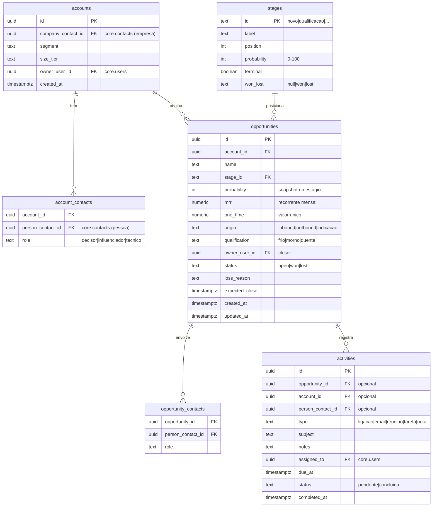

# Design Document — CRM 2.0 (Receita Previsível)

## Overview

Reformula o `mod_crm` para um CRM B2B de Receita Previsível, preservando o contrato do núcleo: contatos/contas vivem em `core.contacts` (permanentes, fonte de verdade), enquanto oportunidades são efêmeras e repetíveis em `mod_crm`. Nenhum dado de contato é copiado para o schema do módulo — apenas `contact_id` como referência.

### Decisões-chave

| Decisão | Escolha | Justificativa |
|---|---|---|
| Lead vs. Oportunidade | Separados: qualificação vira Oportunidade | Núcleo do método Predictable Revenue; funil previsível. |
| Conta | `mod_crm.accounts` referencia `core.contacts` (empresa) | B2B; CNPJ e razão social na base central, sem duplicar. |
| Conta ↔ Contatos | N:N via `mod_crm.account_contacts` (papel) | Múltiplos decisores/influenciadores por conta. |
| Valores | MRR + Valor_Unico na Oportunidade; ARR derivado | Receita recorrente é cidadã de primeira classe. |
| Probabilidade | Herdada do Estagio (configurável) | Forecast ponderado consistente. |
| Migração do `mod_crm.leads` | Converte cada lead em Conta (empresa) + Oportunidade | Não perde os dados de teste; alinha ao novo modelo. |
| Labels/nutrição | Reutiliza categorias/campos/segmentos do núcleo | Histórico permanente já suportado pela fundação. |

## Modelo de dados (schema `mod_crm`)

Observações:
- `accounts.company_contact_id` referencia `core.contacts` (empresa) e registra em `core.contact_references` (contrato de módulo).
- ARR = `mrr * 12` (derivado, não armazenado).
- As tabelas antigas `mod_crm.leads` são migradas e depois descontinuadas (ver Migração).

## Serviços (backend)

- **account-service**: `createAccount` (find-or-create empresa por CNPJ + registerReference), `linkContact`/`unlinkContact` (papel), `getAccount` (com contatos e oportunidades), `listAccounts`.
- **opportunity-service**: `createOpportunity` (exige conta + valores), `moveStage` (atualiza probabilidade a partir do estágio, timeline, auditoria, evento `crm.oportunidade.movida`), `finalize` (won exige valores / lost exige motivo; eventos `crm.oportunidade.ganha|perdida`), `listOpportunities` (filtros), `getOpportunity` (com contatos, atividades, timeline).
- **stage-service**: CRUD de estágios configuráveis; seed do pipeline padrão (Novo 10, Qualificação 25, Descoberta 40, Proposta 60, Negociação 80, Ganho 100/terminal-won, Perdido 0/terminal-lost).
- **activity-service**: `createActivity`, `completeActivity`, `listMyActivities` (pendentes por usuário), `listByOpportunity`.
- **forecast-service** (relatórios): `weightedForecast` (Σ((mrr*12 + one_time) × prob/100) das abertas), `newMrrArr` (período), `conversionByStage`, segmentação por origem/dono.
- **message-service (correção)**: `listConversations(userId)` (group + DMs do usuário com contagem de não lidas), `markRead`. Mantém `sendMessage`/DMs existentes.

## Forecast ponderado (propriedade central)

Para o conjunto de oportunidades abertas: `forecast = Σ ((mrr*12 + one_time) * probability/100)`. Testável por propriedade: dado um conjunto de oportunidades, o forecast é a soma ponderada e ignora as fechadas.

## Telas (frontend)

- **Contas**: lista + detalhe (contatos com papéis, oportunidades, atividades, histórico).
- **Oportunidades**: Kanban por estágio E lista/tabela com filtros (conta, dono, origem, estágio, valor); card mostra conta, MRR, valor único, probabilidade.
- **Oportunidade (detalhe)**: valores, contatos envolvidos, atividades, timeline, ações de mover/finalizar.
- **Atividades**: agenda do usuário (pendentes por data) + registro rápido.
- **Dashboards de Receita Previsível**: forecast ponderado, MRR/ARR novo, conversão por estágio, por origem/vendedor.
- **Conversas (corrigida)**: lista conversas (equipe + DMs) com não lidas; envio.

## Migração do `mod_crm.leads`

Para cada lead existente: cria (ou reusa) Conta a partir do `company_contact_id` (ou cria empresa "sem CNPJ" marcada para completar); cria Oportunidade com `person`/valores (`value_monthly`→`mrr`, `value_activation`→`one_time`), estágio mapeado do `column_id`, dono = `assigned_to`. As telas antigas de "leads" são substituídas por Oportunidades. Tabela `mod_crm.leads` mantida somente durante a transição e removida ao final da fase 1.

## Reuso da fundação

Contatos/segmentos/campos personalizados (labels), eventos (outbox), auditoria imutável e RBAC do núcleo são reutilizados sem alteração. Novos namespaces RBAC: `crm:contas:*`, `crm:oportunidades:*`, `crm:atividades:*`, `crm:forecast:visualizar` (adicionados ao catálogo).

## Estratégia de testes

- PBT: forecast ponderado (soma), probabilidade herdada do estágio, ARR=MRR×12, CNPJ obrigatório/dedup de conta, oportunidades repetíveis por conta.
- Integração HTTP: criar conta→oportunidade→mover→finalizar; listar conversas; dashboards.
- Migração: teste que converte leads e confere contas/oportunidades resultantes.
