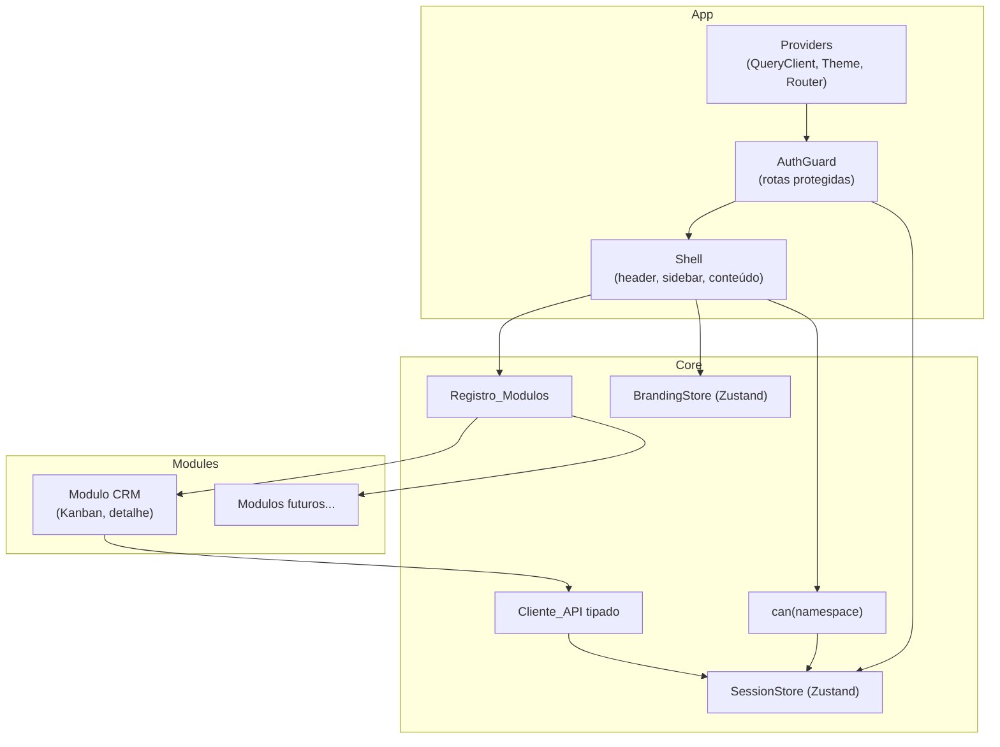

# Design Document — Frontend Web

## Overview

Frontend do HUB Central como SPA React consolidada e extensível. A arquitetura espelha o backend: assim como módulos se acoplam ao núcleo por um contrato, telas de módulos se acoplam ao Shell por um **registro declarativo de módulos**. Isso garante que adicionar um módulo novo (ou evoluir um existente) seja plugar, sem tocar no Shell.

### Decisões de stack

| Área | Escolha | Justificativa |
|---|---|---|
| Framework | React 18 + TypeScript | Maior ecossistema/mercado; segurança de tipos alinhada ao backend TS. |
| Build | Vite | Padrão atual, dev server rápido, build otimizado. |
| UI | Material UI (MUI v6) | Implementação madura de Material Design (§4.3); theming dinâmico para white-label. |
| Estado de servidor | TanStack Query | Cache, invalidação e sincronização com a API (Req 4.4). |
| Estado global | Zustand | Leve, para Sessao e Branding. |
| Rotas | React Router v6 | Padrão de mercado; rotas aninhadas para o Shell. |
| Testes | Vitest + Testing Library | Coerente com o backend (Vitest). |

## Arquitetura de componentes



## Contrato de Módulo Frontend

Cada módulo exporta um objeto `ModuleDefinition` que o Registro agrega. É o análogo frontend do manifesto de módulo do backend.

```ts
interface ModuleDefinition {
  id: string;                    // ex.: "crm"
  title: string;                 // rótulo no menu
  icon: React.ComponentType;     // ícone MUI
  basePath: string;              // ex.: "/crm"
  requiredNamespace?: string;    // RBAC para exibir o módulo
  menu: MenuEntry[];             // itens de navegação (cada um com namespace opcional)
  routes: RouteObject[];         // rotas React Router (relativas ao basePath)
}
```

O Shell monta a sidebar filtrando `menu`/módulos por `can(requiredNamespace)` e injeta as `routes` no Router. Adicionar um módulo = criar seu `ModuleDefinition` e incluí-lo no array do Registro — nada no Shell muda (Req 2.1, 2.2, 2.3).

## Cliente de API e autenticação

- **`ApiClient`** (`src/core/api/client.ts`): wrapper sobre `fetch` que injeta `Authorization: Bearer <token>` a partir do SessionStore (Req 1.7, 4.3), serializa/deserializa JSON e, em erro, lança um `ApiError { code, message, details }` (Req 4.2). Em resposta `401`, dispara logout local e redireciona ao login (Req 1.6).
- **Módulos de API tipados** (`src/core/api/*.ts`): `auth.ts`, `contacts.ts`, `segments.ts`, `crm.ts` — funções que espelham os endpoints do backend, tipadas com as mesmas formas de dados.
- **TanStack Query**: hooks (`useLeads`, `useLead`, `useMoveLead`, ...) encapsulam queries/mutations; mutations invalidam as queries afetadas (Req 4.4).
- **SessionStore (Zustand, persistido)**: `{ token, user, login(), logout() }`. Token em `localStorage` para sobreviver a refresh; limpo no logout/401.

## Branding white-label

- **`BrandingStore` (Zustand)** guarda `{ systemName, logoUrl, primaryColor, secondaryColor }`.
- Um `ThemeProvider` do MUI deriva o tema das cores do Branding em tempo de execução (Req 3.1, 3.2). Sem Branding customizado, usa o tema padrão do HUB Central (Req 3.3).
- O logotipo é exibido no login e no header (Req 3.4).
- Fonte do Branding: por ora, valores default no cliente; futuramente um endpoint `/api/branding` (SuperAdmin) alimenta o store. O contrato do store já prevê atualização sem recompilar.

## Estrutura de pastas

```
frontend/
├── index.html
├── vite.config.ts
├── package.json
├── src/
│   ├── main.tsx                 # bootstrap: providers
│   ├── app/
│   │   ├── App.tsx              # Router + AuthGuard + Shell
│   │   ├── Shell.tsx            # header, sidebar, área de conteúdo
│   │   └── AuthGuard.tsx
│   ├── core/
│   │   ├── api/                 # client + módulos tipados
│   │   ├── auth/                # SessionStore, telas de login/senha
│   │   ├── branding/            # BrandingStore + ThemeProvider
│   │   ├── rbac/                # can(namespace)
│   │   └── modules/             # tipos + Registro_Modulos
│   └── modules/
│       └── crm/                 # ModuleDefinition + telas (Kanban, detalhe)
```

## Empacotamento e entrega (nginx)

- `vite build` gera artefatos estáticos em `frontend/dist` (Req 6.1).
- **nginx** serve os estáticos e faz reverse proxy de `/api/*` para o backend (`http://127.0.0.1:3000`) (Req 6.2), com fallback `try_files ... /index.html` para rotas de SPA (Req 6.3).
- O `install.sh` passa a compilar o frontend e instalar/configurar o nginx (Req 6.4), mantendo a config TLS-ready (comentários para certbot).

## Estratégia de testes

- **Vitest + Testing Library**: componentes-chave (AuthGuard redireciona sem sessão; Shell filtra menu por RBAC; Kanban dispara move).
- **Cliente_API**: teste de que injeta o token e mapeia erro `{code,message,details}`; 401 aciona logout.
- Testes rodam com a API mockada (sem backend real), mantendo-os rápidos e isolados.
