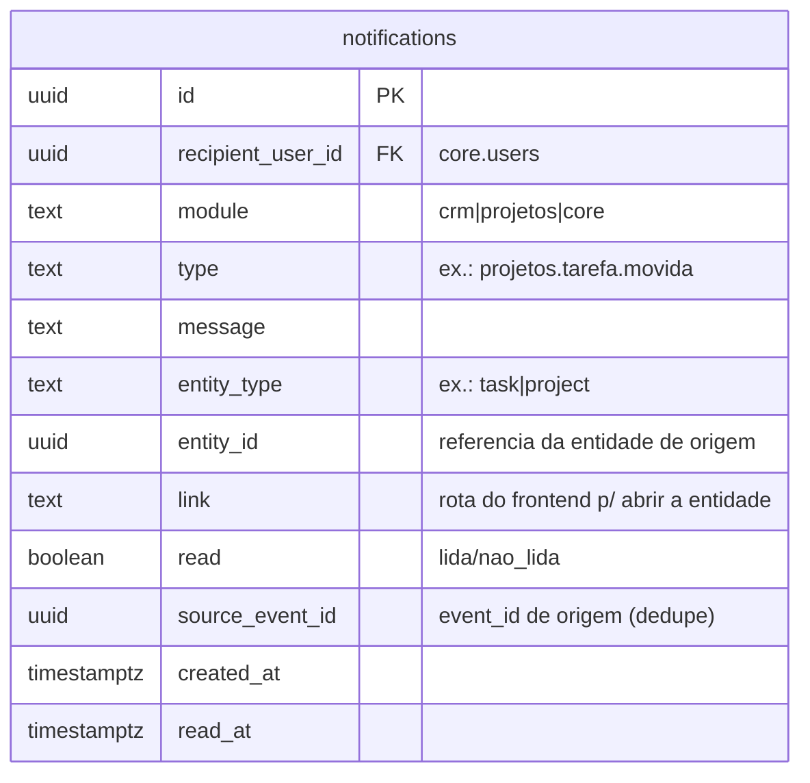
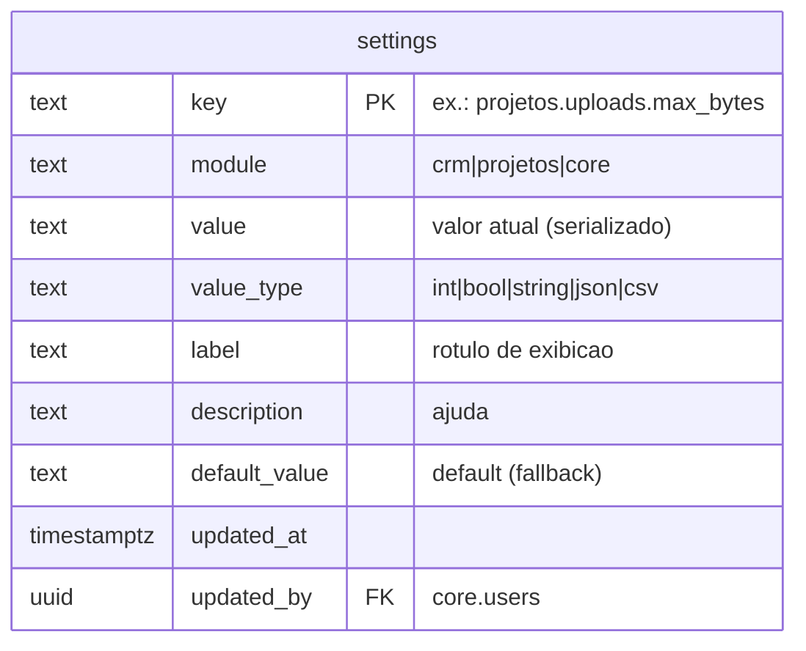
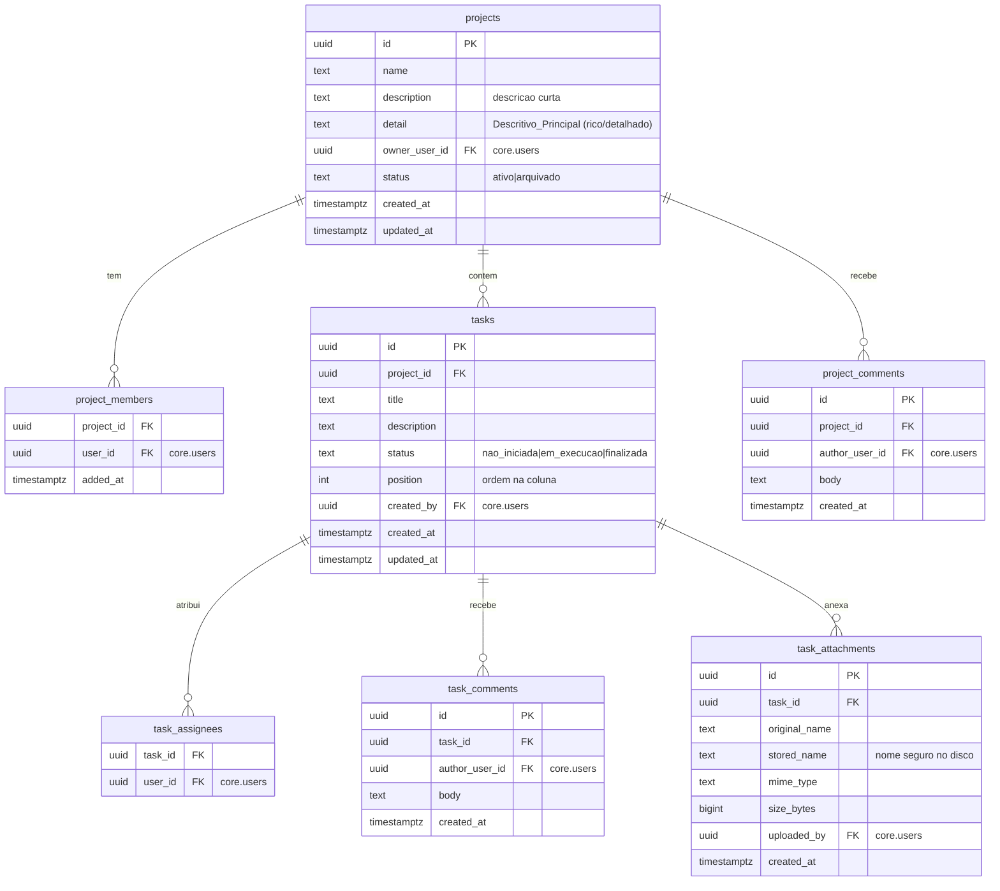

# Design Document — Módulo de Projetos Internos

## Overview

O **Módulo de Projetos Internos** (`mod_projetos`) é o segundo módulo satélite do HUB Central. Ele permite que colaboradores internos (usuários do IAM em `core.users`) organizem trabalho em **projetos** com um **Kanban de três colunas fixas** (Não iniciadas / Em execução / Finalizadas), onde cada **tarefa** recebe comentários e anexos de arquivo. Movimentações relevantes geram **notificações in-app** para os envolvidos e para o dono do projeto, por meio de uma **Central de Notificações do núcleo** (`core.notifications`) — genérica e reutilizável por qualquer módulo.

O módulo respeita o Contrato de Módulos já estabelecido:

- Schema próprio `mod_projetos`; referencia `core.users` apenas por `user_id`, sem duplicar dados de usuário.
- RBAC por namespaces `projetos:recurso:acao`, avaliados pelo guard `authorize` do núcleo.
- Auditoria imutável em `core.system_logs` via `audit-logger` (`module = 'projetos'`).
- Eventos de negócio publicados no transactional outbox (`core.event_outbox`) via `publish`, na mesma transação do dado; um assinante (`subscribe`) transforma eventos em notificações.
- Frontend declarativo: um `ModuleDefinition` registrado em `MODULE_REGISTRY`; o Shell agrega menu e rotas sem conhecer o módulo.

Esta spec também entrega duas peças **transversais ao núcleo**: a Central de Notificações e o **agrupamento do menu lateral por módulo** no Shell.

### Decisões-chave

| Decisão | Escolha | Justificativa |
|---|---|---|
| Notificações | Serviço/tabela do **núcleo** (`core.notifications`) | Reutilizável por CRM e módulos futuros; requisito explícito. |
| Entrega da notificação | Assinante do outbox converte evento → notificação | Desacopla o módulo produtor da lógica de entrega; segue o EDA existente. |
| Colunas do Kanban | 3 estados fixos numa coluna `status` (enum textual) | Sem tabela de colunas; simplicidade e consistência entre projetos. |
| Anexos | Arquivo em disco local; metadados em `mod_projetos.task_attachments` | Sem dependência externa; alinhado à infra atual (VM). |
| Acesso ao projeto | Participação (dono/membro) além do namespace | Não-participante não enxerga nem lista nem detalhe (requisito). |
| Comentários | Tabelas separadas `project_comments` e `task_comments` | Entidades-pai distintas; consultas e FKs mais limpas. |
| Ordenação no Kanban | Coluna `position` (numérica) por tarefa | Preserva ordem manual dentro de cada coluna. |
| Membros | `mod_projetos.project_members` (N:N) + `owner_user_id` no projeto | Dono é papel dedicado; membros são o conjunto de participantes. |

## Modelo de dados

### Núcleo — Central de Notificações (schema `core`)



`core.notifications` é agnóstica de módulo: qualquer produtor grava uma notificação para um destinatário. O campo `module` permite filtrar por origem (usado pelo namespace `projetos:notificacoes:visualizar`). `link` guarda a rota do SPA (ex.: `/projetos/123/tarefas/456`) para navegação ao clicar.

### Núcleo — Central de Configurações (schema `core`)



`core.settings` é a **Central de Configurações do HUB Central**, genérica e reutilizável: cada módulo registra suas chaves (namespaced por `modulo.recurso.parametro`) com tipo, rótulo, descrição e default. A UI de administração agrupa os parâmetros por `module`. Resolução de valor: **valor persistido** → senão **`default_value`** → senão **variável de ambiente** (fallback inicial). Alterações são auditadas em `core.system_logs`. O acesso exige o namespace `core:config:gerenciar`.

Chaves registradas pelo Módulo de Projetos (seed na migration do módulo):

| key | tipo | default | uso |
|---|---|---|---|
| `projetos.uploads.max_bytes` | int | 26214400 (25 MB) | Limite de tamanho por anexo |
| `projetos.uploads.allowed` | csv | `pdf,png,jpg,jpeg,gif,webp,txt,doc,docx,xls,xlsx,ppt,pptx,zip` | Extensões/MIME permitidos |

### Módulo — schema `mod_projetos`



Regras de integridade e índices:

- `tasks.status` e `projects.status` são validados por `CHECK`.
- `project_members` PK composta `(project_id, user_id)`; `task_assignees` PK composta `(task_id, user_id)`.
- `ON DELETE CASCADE` de `projects`→(`tasks`, `project_members`, `project_comments`) e de `tasks`→(`task_assignees`, `task_comments`, `task_attachments`). Exclusão de projeto/tarefa é rara (usamos arquivamento), mas o cascade mantém consistência.
- Índices: `tasks (project_id, status, position)`, `task_assignees (user_id)`, `notifications (recipient_user_id, read)`.
- Referências a `core.users` são apenas FKs de `user_id`; nenhum dado de usuário é copiado.

### Migrations (node-pg-migrate, SQL puro)

Seguindo o padrão do repositório (arquivos `TIMESTAMP_nome.up.sql` / `.down.sql` em `migrations/`), na sequência após as migrations do CRM:

1. `..._core-notifications` — cria `core.notifications` e índices. (Núcleo, reutilizável.)
2. `..._core-settings` — cria `core.settings` e índices. (Núcleo, reutilizável.)
3. `..._projetos-schema` — `CREATE SCHEMA mod_projetos` + `projects`, `project_members`.
4. `..._projetos-tasks` — `tasks`, `task_assignees`.
5. `..._projetos-comments-attachments` — `project_comments`, `task_comments`, `task_attachments`; seed das chaves de configuração de anexo em `core.settings`.

Cada `.up.sql` tem seu `.down.sql` simétrico (drop na ordem inversa). O schema `mod_projetos` é criado por este módulo (o CRM criou `mod_crm` de forma análoga).

## Autorização e regra de acesso ao projeto

O RBAC do núcleo (`authorize`) cobre a **capacidade** (o usuário pode, em geral, executar a ação). A **regra de participação** cobre o **escopo** (o usuário só acessa projetos em que é dono ou membro). Ambas são exigidas.

- `authorize(client, userId, ns)` — verifica o namespace; lança `RBAC_ACCESS_DENIED`/`AUTH_UNAUTHORIZED`.
- `assertProjectAccess(client, userId, projectId)` — helper do módulo que verifica se `userId` é `owner_user_id` do projeto **ou** consta em `project_members`. Se não, lança `PROJ_ACCESS_DENIED` (novo código de erro). A listagem de projetos filtra por participação diretamente na query (não retorna projetos alheios), atendendo aos critérios 1.7–1.9 e 2.3.

Namespaces declarados (adicionados a um novo `PROJETOS_NAMESPACES` em `src/core/iam/namespaces.ts`, e incluídos em `ALL_NAMESPACES` para o bootstrap do SuperAdministrador):

```
projetos:projeto:visualizar   projetos:projeto:criar     projetos:projeto:editar
projetos:projeto:arquivar     projetos:membros:gerenciar
projetos:tarefa:visualizar    projetos:tarefa:criar      projetos:tarefa:editar
projetos:tarefa:mover         projetos:tarefa:atribuir
projetos:comentario:criar     projetos:anexo:enviar      projetos:anexo:baixar
projetos:anexo:excluir        projetos:notificacoes:visualizar
```

`projetos:comentario:criar` cobre comentário de tarefa e de projeto (decisão da spec de requisitos).

## Eventos e notificações

### Eventos publicados (outbox)

| Evento | Quando | Payload (ids apenas) |
|---|---|---|
| `projetos.tarefa.movida` | Tarefa muda de coluna | `task_id`, `project_id`, `from`, `to`, `actor_user_id` |
| `projetos.tarefa.atribuida` | Nova atribuição | `task_id`, `project_id`, `assignee_user_id`, `actor_user_id` |
| `projetos.comentario.criado` | Comentário em tarefa | `task_id`, `project_id`, `comment_id`, `actor_user_id` |
| `projetos.projeto.comentado` | Comentário no projeto | `project_id`, `comment_id`, `actor_user_id` |

Todos seguem o formato `[modulo].[recurso].[acao]` exigido pelo `event-bus` e são publicados com `publish(client, buildEnvelope(...))` na mesma transação da mudança.

### Assinante → notificações

Um único assinante do módulo (`registerProjetosNotifier`, chamado no bootstrap junto ao worker de outbox) faz `subscribe("projetos.*", handler)`. O handler:

1. Determina os **destinatários** conforme o evento (ver tabela abaixo), sempre **excluindo o autor** (`actor_user_id`) para evitar auto-notificação.
2. Insere uma linha em `core.notifications` para cada destinatário, com `module='projetos'`, `type=event_name`, `message` legível, `entity_type`/`entity_id` e `link` para o frontend.

| Evento | Destinatários |
|---|---|
| `projetos.tarefa.movida` | Atribuídos da tarefa + Dono_Projeto |
| `projetos.tarefa.atribuida` | Usuário atribuído + Dono_Projeto |
| `projetos.comentario.criado` | Atribuídos da tarefa + Dono_Projeto |
| `projetos.projeto.comentado` | Dono_Projeto + todos os Membros do projeto |

Como o `dispatchPending` roda pós-commit e a entrega é "ao menos uma vez", o handler faz insert idempotente por `(recipient, type, entity_id, created within event)` — na prática, deduplicamos por `event_id` guardado em `notifications` (coluna opcional `source_event_id`) para não duplicar em reprocessamento.

## Componentes (backend)

Serviços em `src/modules/projetos/`, seguindo o estilo dos serviços do CRM (funções puras recebendo `PoolClient`, auditoria e eventos na mesma transação):

- **`project-service.ts`**
  - `createProject(client, { name, description, detail, ownerUserId }, actor)` → cria projeto `ativo`, adiciona o dono como membro, audita `PROJ_PROJETO_CRIADO`.
  - `updateProject(client, id, patch, actor)` → nome/descrição/detail/dono; audita.
  - `archiveProject(client, id, actor)` → status `arquivado`; audita.
  - `listProjectsForUser(client, userId)` → só projetos onde é dono ou membro.
  - `getProject(client, id, userId)` → detalhe; chama `assertProjectAccess`.
  - `assertProjectAccess(client, userId, projectId)` → dono ou membro, senão lança `PROJ_ACCESS_DENIED`.
- **`member-service.ts`** — `addMember`, `removeMember`, `listMembers`; audita; remover membro remove suas atribuições (critério 2.5).
- **`task-service.ts`**
  - `createTask(client, { projectId, title, description }, actor)` → status `nao_iniciada`, `position` = fim da coluna; bloqueia se projeto arquivado.
  - `updateTask`, `listTasksByProject` (agrupadas por status, ordenadas por position).
  - `moveTask(client, taskId, toStatus, toPosition, actor)` → atualiza status/position, audita, `publish(projetos.tarefa.movida)`. Bloqueia se projeto arquivado.
- **`assignment-service.ts`** — `assign(client, taskId, userId, actor)` (valida que o alvo é dono/membro), `unassign`; audita; `assign` publica `projetos.tarefa.atribuida`.
- **`comment-service.ts`** — `addTaskComment` / `addProjectComment`; audita; publica os eventos de comentário.
- **`attachment-service.ts`** — `saveAttachment` (grava metadados após o arquivo estar em disco), `listAttachments`, `getAttachment` (para download), `deleteAttachment` (remove arquivo + metadados; audita).

Núcleo:

- **`src/core/notifications/notification-service.ts`** — `notify(client, { recipientUserId, module, type, message, entityType, entityId, link, sourceEventId })` (insert idempotente por `source_event_id`+destinatário), `listForUser(client, userId, { unreadOnly })`, `markRead(client, userId, notificationId)`, `unreadCount(client, userId)`.
- **`src/modules/projetos/notifier.ts`** — `registerProjetosNotifier()` assina `projetos.*` e chama `notify` para os destinatários. Recebedores calculados com `assignment`/`member` services.
- **`src/core/settings/settings-service.ts`** (núcleo) — `getSetting(client, key)` (resolve persistido → default → env), `getSettingInt`/`getSettingList` (helpers tipados), `listSettings(client, { module })` (agrupável por módulo), `setSetting(client, key, value, actor)` (persiste + audita), `registerSetting(client, def)` (idempotente; usado pelas migrations/seed para declarar chave/tipo/label/default). O `attachment-service` consome `getSettingInt("projetos.uploads.max_bytes")` e `getSettingList("projetos.uploads.allowed")`.

### Armazenamento de anexos (disco local)

- Diretório base configurável por env `UPLOADS_DIR` (default `/opt/hubcentral/uploads`); subpasta por projeto/tarefa: `<UPLOADS_DIR>/projetos/<project_id>/<task_id>/`.
- **Nome seguro**: o arquivo é salvo com `stored_name = <uuid>.<ext-normalizada>`; o `original_name` fica só nos metadados. Isso elimina travessia de diretório e colisões (critério 7.3).
- **Validação** (critério 7.3–7.4): tamanho máximo e allowlist de tipos/extensões vêm da **Central de Configurações** (`core.settings`, chaves `projetos.uploads.max_bytes` e `projetos.uploads.allowed`), resolvidas em tempo de request. Se a chave não tiver valor persistido, usa o `default_value`, e por fim a env (`UPLOADS_MAX_BYTES`/`UPLOADS_ALLOWED`) como fallback inicial. Rejeição retorna erro de domínio sem persistir.
- Upload via `@fastify/multipart`; o handler valida antes de escrever, escreve num arquivo temporário e faz `rename` atômico para o destino.
- **Download** (critério 7.5): rota autenticada exige `projetos:anexo:baixar` **e** `assertProjectAccess`; faz stream do arquivo com `Content-Disposition` usando `original_name`. Arquivos nunca são servidos como estáticos públicos.
- **Instalador/backup** (critério 7.7): `scripts/install.sh` cria `UPLOADS_DIR` (dono `hubcentral`), e a documentação de backup passa a incluir esse diretório.

## API HTTP (Fastify)

Rotas em `src/http/routes/projetos.ts` (registradas em `app.ts`) e `src/http/routes/notifications.ts` (núcleo). Todas exigem sessão (Bearer) e aplicam `authorize` + `assertProjectAccess` quando cabível.

| Método | Rota | Namespace | Ação |
|---|---|---|---|
| GET | `/api/projetos` | `projetos:projeto:visualizar` | Lista só os projetos do usuário |
| POST | `/api/projetos` | `projetos:projeto:criar` | Cria projeto |
| GET | `/api/projetos/:id` | `projetos:projeto:visualizar` + acesso | Detalhe (com membros e comentários) |
| PATCH | `/api/projetos/:id` | `projetos:projeto:editar` + acesso | Edita nome/descrição/detail/dono |
| POST | `/api/projetos/:id/archive` | `projetos:projeto:arquivar` + acesso | Arquiva |
| GET/POST/DELETE | `/api/projetos/:id/members` | `projetos:membros:gerenciar` + acesso | Gerencia membros |
| POST | `/api/projetos/:id/comments` | `projetos:comentario:criar` + acesso | Comenta no projeto |
| GET | `/api/projetos/:id/tasks` | `projetos:tarefa:visualizar` + acesso | Tarefas (Kanban) |
| POST | `/api/projetos/:id/tasks` | `projetos:tarefa:criar` + acesso | Cria tarefa |
| GET | `/api/projetos/tasks/:taskId` | `projetos:tarefa:visualizar` + acesso | Detalhe da tarefa |
| PATCH | `/api/projetos/tasks/:taskId` | `projetos:tarefa:editar` + acesso | Edita tarefa |
| PATCH | `/api/projetos/tasks/:taskId/move` | `projetos:tarefa:mover` + acesso | Move de coluna |
| POST/DELETE | `/api/projetos/tasks/:taskId/assignees` | `projetos:tarefa:atribuir` + acesso | Atribui/desatribui |
| POST | `/api/projetos/tasks/:taskId/comments` | `projetos:comentario:criar` + acesso | Comenta na tarefa |
| POST | `/api/projetos/tasks/:taskId/attachments` | `projetos:anexo:enviar` + acesso | Envia anexo (multipart) |
| GET | `/api/projetos/attachments/:id` | `projetos:anexo:baixar` + acesso | Baixa anexo (stream) |
| DELETE | `/api/projetos/attachments/:id` | `projetos:anexo:excluir` + acesso | Exclui anexo |
| GET | `/api/notifications` | autenticado | Notificações do usuário (`?unread=1`) |
| GET | `/api/notifications/unread-count` | autenticado | Contador de não lidas |
| POST | `/api/notifications/:id/read` | autenticado | Marca como lida |
| GET | `/api/settings` | `core:config:gerenciar` | Lista configurações (agrupadas por módulo) |
| PATCH | `/api/settings/:key` | `core:config:gerenciar` | Atualiza um parâmetro |

Novos códigos de erro em `src/core/errors.ts`: `PROJ_ACCESS_DENIED`, `PROJ_NOT_FOUND`, `PROJ_TASK_NOT_FOUND`, `PROJ_ARCHIVED`, `PROJ_ATTACHMENT_INVALID`, `PROJ_ATTACHMENT_NOT_FOUND`.

## Frontend

### Cliente e hooks

- `frontend/src/core/api/projetos.ts` — funções tipadas para as rotas acima (listProjects, getProject, createProject, updateProject, archiveProject, members, tasks, moveTask, assignees, comments, attachments upload/download/delete).
- `frontend/src/core/api/notifications.ts` — `listNotifications`, `unreadCount`, `markRead`.
- `frontend/src/modules/projetos/hooks.ts` — hooks TanStack Query (queries + mutations com invalidação), espelhando `sales-hooks.ts` do CRM.
- `frontend/src/core/notifications/hooks.ts` — `useUnreadCount` (com `refetchInterval`), `useNotifications`, `useMarkRead`.

### Telas (`frontend/src/modules/projetos/`)

- **`ProjectsPage.tsx`** — lista dos projetos do usuário (cards ou tabela), botão "Novo projeto" (dialog com nome, descrição, descritivo principal).
- **`ProjectDetailPage.tsx`** — cabeçalho (nome, dono, status), descritivo principal, aba/lista de membros (adicionar/remover se `projetos:membros:gerenciar`), comentários do projeto, e o **Kanban** das tarefas.
- **`ProjectBoard.tsx`** — Kanban de 3 colunas fixas (Não iniciadas / Em execução / Finalizadas); drag-and-drop entre colunas (desabilitado sem `projetos:tarefa:mover`), reordenação por `position`. Reaproveita o padrão de DnD nativo já usado no `OpportunitiesBoard`.
- **`TaskDetailPage.tsx`** (ou dialog) — título/descrição, atribuídos (chips, adicionar/remover), comentários (lista cronológica + campo de novo comentário), anexos (upload, lista com download e excluir).
- **`module.tsx`** — `ModuleDefinition` com `id: "projetos"`, `title: "Projetos Internos"`, `basePath: "/projetos"`, menu (Projetos) e rotas; registrado em `MODULE_REGISTRY`.

### Central de notificações (núcleo, no Shell)

- **`frontend/src/core/notifications/NotificationBell.tsx`** — ícone de sino no `AppBar` do Shell com badge do contador de não lidas (`useUnreadCount`, refetch periódico). Ao abrir, um menu/popover lista as notificações recentes; clicar navega para `link` e marca como lida; ação "marcar todas como lidas".
- O sino é montado no `Shell` (núcleo), disponível para qualquer módulo — o CRM poderá produzir notificações futuramente sem mudar o Shell.

### Central de Configurações (admin, núcleo)

- **`frontend/src/core/api/settings.ts`** — `listSettings()`, `updateSetting(key, value)`.
- **`frontend/src/modules/admin/SettingsPage.tsx`** — tela de administração que lista os parâmetros **agrupados por módulo** (seção "Projetos Internos", "CRM", etc.), cada parâmetro renderizado conforme `value_type` (número, booleano, texto, lista/CSV) com rótulo e descrição; salvar chama `updateSetting`. Entra no menu do módulo Administração sob o namespace `core:config:gerenciar`. É a "central de configurações do HUB Central" onde os módulos expõem seus ajustes.

### Menu lateral agrupado por módulo (Shell)

Alteração no `Shell.tsx` e no contrato de módulos:

- Hoje o Shell faz `flatMap` de todos os itens numa lista plana. Passará a **iterar por módulo**: para cada `ModuleDefinition` cujo usuário tenha permissão em ao menos um item, renderiza um **cabeçalho de seção** (`ListSubheader` com `module.title`) seguido dos itens permitidos daquele módulo; um `Divider` separa módulos.
- `WHERE` o usuário não tem permissão para nenhum item de um módulo, a seção inteira é omitida (critério 11.3).
- Não requer mudança no `ModuleDefinition` (já tem `title` e `menu`); é uma mudança de renderização, aplicada uniformemente a CRM, Projetos e Administração (critério 11.4).

## Segurança

- **Autorização em duas camadas**: namespace (capacidade) + `assertProjectAccess` (escopo/participação) em toda rota de projeto/tarefa/anexo. A listagem filtra por participação na query.
- **Anexos**: allowlist de tipo + limite de tamanho; `stored_name` gerado (UUID) evita path traversal; download só via rota autenticada com verificação de acesso; nunca servidos como estáticos.
- **Conteúdo não confiável**: nomes de arquivo e textos de comentário são tratados como dados; no frontend, renderizados como texto (sem `dangerouslySetInnerHTML`).
- **Auditoria**: toda criação/edição/movimentação/atribuição/comentário/anexo grava em `core.system_logs` com `module='projetos'`.

## Estratégia de testes

Espelha a base existente (Vitest + Testcontainers para Postgres real; sem mocks de banco):

- **Serviços (integração com Postgres)**: criação/edição/arquivamento de projeto; regra de acesso (não-participante não lista nem acessa); Kanban (criar, mover entre colunas, ordenação); atribuição (valida participação; remove atribuição ao remover membro); comentários (tarefa e projeto); anexos (validação de tamanho/tipo, nome seguro, exclusão remove arquivo).
- **Eventos → notificações**: publicar cada evento e verificar que o assinante cria as notificações corretas para os destinatários certos (incluindo o dono, excluindo o autor) e deduplica por `source_event_id`.
- **RBAC**: cada rota nega sem o namespace; nega acesso a projeto alheio mesmo com namespace.
- **Notificações (núcleo)**: `notify`/`listForUser`/`markRead`/`unreadCount`.
- **Frontend**: testes de unidade dos helpers e de RBAC no menu agrupado (seção some sem permissão); build/typecheck no CI.

## Impacto operacional / implantação

- **Migrations** rodam automaticamente na atualização (instalador já executa `migrate:up`).
- **Env novas**: `UPLOADS_DIR`, `UPLOADS_MAX_BYTES`, `UPLOADS_ALLOWED` (documentar em `.env.example`).
- **Instalador**: cria `UPLOADS_DIR` com dono `hubcentral`; documentação de backup inclui o diretório.
- **RBAC**: novos namespaces `projetos:*` e `core:config:gerenciar` entram em `ALL_NAMESPACES`; o SuperAdministrador os recebe ao rodar o `reset-admin.sh`/bootstrap. Usuários/perfis existentes precisam de reconcessão (nota operacional, como no CRM 2.0).
- **Dependência nova**: `@fastify/multipart` para upload.
- **Central de Configurações**: as env `UPLOADS_*` passam a ser apenas o fallback inicial; o valor efetivo dos limites de anexo é lido de `core.settings` e editável na tela de administração, atendendo à diretriz de que a central de configurações concentre os ajustes dos módulos.

## Rastreabilidade (requisitos → design)

| Requisito | Onde é atendido |
|---|---|
| 1 Projetos (+detalhe, acesso) | `projects`, `project-service`, `assertProjectAccess`, rotas `/api/projetos` |
| 2 Membros (+acesso) | `project_members`, `member-service`, listagem filtrada |
| 3 Kanban 3 colunas fixas | `tasks.status` enum, `ProjectBoard` |
| 4 Movimentação | `moveTask`, evento `projetos.tarefa.movida`, notificação |
| 5 Atribuição | `task_assignees`, `assignment-service`, evento/notificação |
| 6 Comentários em tarefa | `task_comments`, `comment-service`, evento/notificação |
| 7 Anexos disco local | `task_attachments`, `attachment-service`, `UPLOADS_DIR`, instalador |
| 8 Central de notificações | `core.notifications`, `notification-service`, `NotificationBell` |
| 9 RBAC | `PROJETOS_NAMESPACES`, `authorize` nas rotas |
| 10 Auditoria e eventos | `audit-logger`, `publish`/outbox, `notifier` |
| 11 Menu agrupado | `Shell.tsx` por módulo |
| 12 Comentários no projeto | `project_comments`, evento `projetos.projeto.comentado` |
| 13 Central de Configurações | `core.settings`, `settings-service`, `SettingsPage` (admin), consumo nos anexos |
